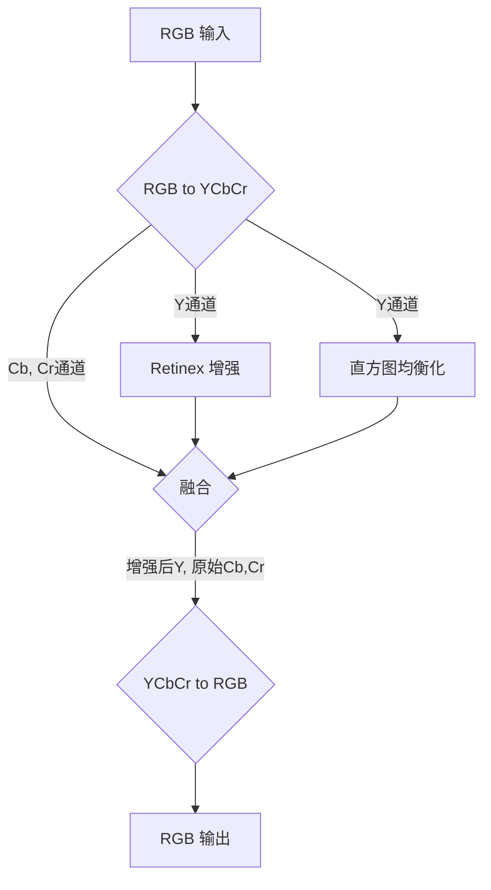

# FPGA 图像增强算法详解

本文档详细介绍了在 `FPGA-Retinex-HE-Enhancement-Optimized` 项目中使用的图像增强算法的原理、数学逻辑和硬件实现优化。整个处理流程被设计为一条高效的流水线，以在FPGA上实现实时处理。

## 整体处理流水线

输入图像数据流首先经过色彩空间转换，然后其亮度通道被并行送入两个增强模块（Retinex 和直方图均衡化），处理结果经过融合后，再与原始色度通道合并，最终转换回RGB格式输出。 

---

## 步骤 1: 色彩空间转换 (RGB to YCbCr)

为了将图像的亮度和色度信息分离，我们首先将输入的24位RGB图像转换为YCbCr格式。这样，后续的增强算法可以仅作用于亮度通道（Y），而保持色度（Cb, Cr）不变，从而在增强图像对比度的同时保留原始色彩。

**数学公式:**

转换基于ITU-R BT.601标准，使用定点数运算在硬件中高效实现：

%20%5Cgg%208)
%20%5Cgg%208)%20&plus;%20128)
%20%5Cgg%208)%20&plus;%20128)

其中，`>> 8` 代表右移8位，相当于除以256，这是为了在整数运算中处理浮点系数。

---

## 步骤 2: Y通道并行增强

亮度通道Y被同时送入两个不同的增强模块：**Retinex** 和 **直方图均衡化 (HE)**。

### 2.1 Retinex 算法

**理论基础:**
Retinex 理论认为，人眼感知到的图像 `S(x,y)` 是由场景的光照分量 `L(x,y)` 和物体的反射分量 `R(x,y)` 相乘得到的。
%20=%20L(x,y)%20%5Ctimes%20R(x,y))
图像增强的目标是削弱光照分量 `L` 的影响，突出反映物体本质的反射分量 `R`。在对数域中，这可以简化为减法：
%20=%20%5Clog(S)%20-%20%5Clog(L))

**硬件实现:**
在本项目中，我们采用了一个简化的Retinex模型，直接在亮度域进行减法操作，并使用像素的**局部平均值**来近似光照分量 `L`。

- **局部平均值计算**: 我们使用一个 **3x3** 的窗口来计算每个像素的局部平均值。为避免在FPGA中实现高成本的除法器，我们将除以9的操作优化为乘以其倒数的定点数形式：
  %20/%209%20%5Capprox%20((%5Csum_{i=0}^{8}%20Y_i)%20%5Ctimes%2028)%20%5Cgg%208)
  因为 `1/9 ≈ 28/256`。

- **流水线加法器树**: 为了高效计算3x3窗口内9个像素的总和，我们设计了一个**4级流水线加法器树**，取代了会产生巨大组合逻辑延迟的嵌套 `for` 循环。这确保了模块可以在高时钟频率下稳定工作。

### 2.2 直方图均衡化 (HE)

**理论基础:**
直方图均衡化通过拉伸图像的亮度动态范围来增强对比度。它将原始图像的灰度直方图重新映射，使得输出图像的灰度分布尽可能均匀。

其核心是累积分布函数 (CDF)。对于灰度级 `g`，其映射后的新灰度级 `h(g)` 计算如下：
%20=%20round%5Cleft(%20%5Cfrac{CDF(g)%20-%20CDF_{min}}{M%20%5Ctimes%20N%20-%20CDF_{min}}%20%5Ctimes%20(L-1)%20%5Cright))
其中 `CDF(g)` 是灰度级 `g` 的累积分布，`CDF_min` 是最小的非零累积分布值，`M x N` 是总像素数，`L` 是灰度级数（通常为256）。

**硬件实现 (单遍近似算法):**
传统的两遍HE算法需要一个帧缓存，消耗大量BRAM。我们实现了一个**单遍近似HE算法**，它使用**前一帧**的直方图统计数据来处理**当前帧**，从而避免了帧缓存。

1.  **直方图统计**: 在处理一帧的同时，统计该帧的灰度直方图并存储在BRAM中。
2.  **查找表 (LUT) 生成**: 在帧消隐期（vertical blanking），利用上一帧的直方图数据计算CDF，并生成一个映射查找表 (LUT)。这一计算过程被分解为多个状态，流水线式执行，以满足时序要求。
    - **除法优化**: 与Retinex类似，公式中的除法被优化为定点数乘法和移位。
3.  **像素映射**: 在处理下一帧时，每个输入像素的亮度值 `Y_in` 直接通过查询LUT得到其映射后的输出值 `Y_out`。

---

## 步骤 3: 结果融合

为了结合Retinex（保留细节）和HE（增强全局对比度）的优点，我们将两个模块的输出进行加权平均融合。

**数学公式:**
%20%5Ctimes%20Y_{he})
在当前实现中，我们选择 `w = 0.5`，这可以通过一次加法和一次右移操作高效完成：
%20%5Cgg%201)

---

## 步骤 4: 色彩空间转换 (YCbCr to RGB)

最后，我们将增强后的亮度通道 `Y_final` 与原始的色度通道 `Cb` 和 `Cr` 合并，并转换回RGB色彩空间，以便在显示器上正确显示。

**数学公式:**

)%20%5Cgg%208%20))
%20&plus;%20183%20%5Ctimes%20(C_r-128))%20%5Cgg%208%20))
)%20%5Cgg%208%20))

输出的R, G, B值会被裁剪（clip）到 `[0, 255]` 范围内，以防止溢出。

---

## 总结

通过上述流水线设计和一系列硬件优化（如流水线加法器树、单遍近似算法、定点数运算替代除法），本项目在FPGA上实现了一个高性能、低资源的实时图像增强系统。